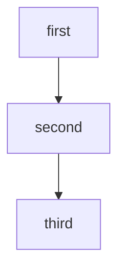

## A thread is simple and creative way of saying that the object is will work under

"A thread is a lightweight programmin in execution "
it can handle 100 and thousands of operation per second. 
So when you answer a question, what you really do you create an object on that.

features| threads |process
|---|---------|---|
|what is| A  thread is lightweight programm in execution| 1. a program in execution is called a process
|kya hota hai ki 
```c++
#include<iosaream>
using namespace std;
int main() {
    int thread
}
```
######  
